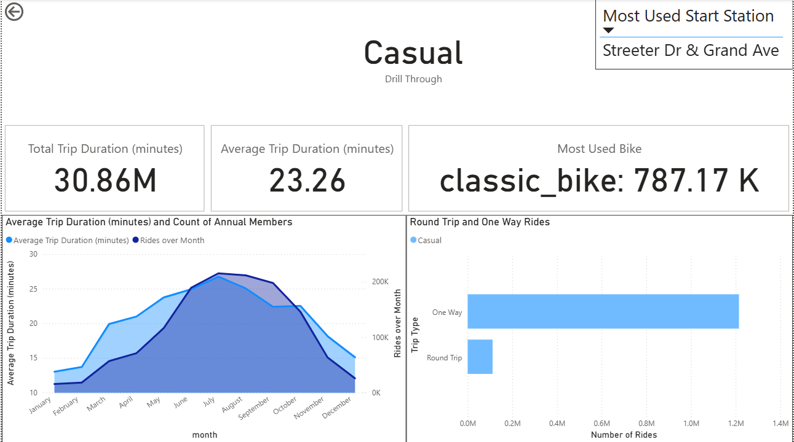
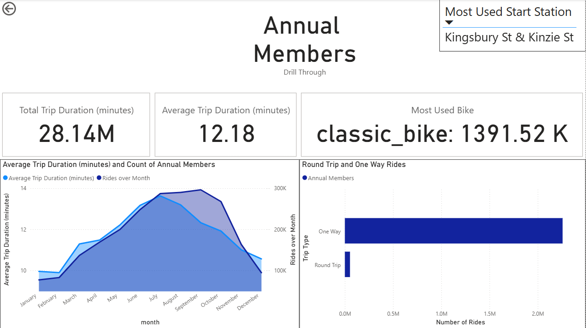

# Introduction
- This is a capstone project in [Google's Data Analytics Professional Certificate](https://www.coursera.org/professional-certificates/google-data-analytics) Coursera Course. Cyclistic is a fictional bike-share company based in Chicago. Cyclistic has 5824 bikes and 692 geotracked stations. The director of marketing believes that the company can suceed by converting their Casual Users into members with Annual Memberships.This can be achieved by asking 3 critical questions 
> 1. How do annual members and casual riders use Cyclistic bikes differently? 
> 2. Why would casual riders buy Cyclistic annual memberships? 
> 3. How can Cyclistic use digital media to influence casual riders to become members?
- This project focuses on the first of these questions namely 
  > How do annual members and casual riders use Cyclistic bikes differently? 
- To do this the data is used from 2024-07 to 2025-06 taken from [here](https://divvy-tripdata.s3.amazonaws.com/index.html), which is [licenced](https://divvybikes.com/data-license-agreement) by Motivate International Inc. 
- My initial hypothesis before going into this was that-because how the annual and casual riders are categorized-that the key to the answer would be in total trip duration or in average trip duration, but to my surpise that is not the case at all. The answer lies in the distribution of number of trips over weekly, but mainly monthly scales. 
# Data Cleaning
- For data cleaning I decided to use SQL Language(PostrgreSQL) and a little bit of python. 
- After getting all the data I had to combine it all in a single csv file or to load it all in a single database. I decided to do both just to check which one is faster. I used [Combine_data.py](Data\Combine_data.py) to combine all the csvs and then to dump them in a single DB directly using [import_all_python.sql](Data\import_all_python.sql). To load all the files directly into PSQL Database I used [import_all.sql](Data\import_all.sql) in PSQL Tool by `/i C://PATH//TO//FOLDER//import_all.sql`. For results, the method with python was much quicker. 
- The data contains 13 columns in total as follows:

| No. | column name        | dtype     | Description                                             |
| --- | ------------------ | --------- | ------------------------------------------------------- |
| 1   | ride_id            | STRING    | Unique ID assigned to each ride                         |
| 2   | rideable_type      | STRING    | classic, docked, or electric                            |
| 3   | started_at         | TIMESTAMP | Date and time at the start of trip                      |
| 4   | ended_at           | TIMESTAMP | Date and time at the end of trip                        |
| 5   | start_station_name | STRING    | Name of the station where the ride journey started from |
| 6   | start_station_id   | STRING    | ID of the station where the ride journey started from   |
| 7   | end_station_name   | STRING    | Name of the station where the ride trip ended at        |
| 8   | end_station_id     | STRING    | ID of the station where the ride trip ended at          |
| 9   | start_lat          | FLOAT     | Latitude of starting station                            |
| 10  | start_lng          | FLOAT     | Longitude of starting station                           |
| 11  | end_lat            | FLOAT     | Latitude of ending station                              |
| 12  | end_lng            | FLOAT     | Longitude of ending station                             |
| 13  | member_casual      | STRING    | Type of membership of each rider                        |

- Now that I have all the data in a single DB I used [DBeaver](https://dbeaver.io/download/) to connect with my PSQL DB and run some data cleaning checks.

    1. Removed all rows where `start_station_name` , `end_station_name` , `start_station_id` or `end_station_id` , `ride_id` , `rideable_type` were `NULL`.
    2. Removed values where `started_at` was less than `ended_at`.
    3. Also checked for trips with the same `ride_id` but there were none of those.
    4. Removed values where `start_id` or `end_id` were attached to multiple `start_station_name` and `end_station_name` respectively. 
    5. I created a CTE(Common Table Expression) in a view [trip_analysis_view.sql](trip_analysis_view.sql) and used it to check for trips with duration < 1 minute and removed those as well as these values are unrealistic for a bike share trip. 
- After all this cleaning the final table as defined in the `trip_analysis` CTE was put into a csv file. It has about 3.86M rows, which prior to cleaning were around 5M. This shows that a lot of the data might have faulty or NULL values which were removed.
# Data Analysis
- For analysis of trip duration for both groups I also exported some data in the [trip_duration.csv](Data\trip_duration.csv) file. Then I used the [trip_duration_analysis.py](trip_duration_analysis.py) to analyze this data and to my surprise found no relation between the trip duration and the membership. The figure below shows the density of trip duration(basically the probability of trip duration being in some interval) on the y-axis and trip duration(in minutes) on the x-axis. 

- There is no visual difference in how long the Annual members and Casual riders use the bike for. The average trip duration is pretty low for both, but there is still some difference. For annual members the average trip duration is **12.16 mins** and for casual users it is **23.20 mins**. This suggests that casual users use the bike for longer time and take it only for longer rides, on the other hand annual members use it for much smaller trips as well. 
- Now to find further differences I decided to use [POWER BI](https://www.microsoft.com/en-us/download/details.aspx?id=58494), which is a visualization tool, to analyse differences between the two member types in their use of bikes. 
- I first created the main dashboard which shows the difference in their total rides and their favorite bike types. It also shows mean trip duration over month for both members. 
 

- The right hand side of the dashboard focuses on the total rides over month and week which differ quite significantly for both. To further understand this I also created a Drill Through page for both Annual and casual users. But if you want to analyse these metrics for various selections there are also 4 different slicers on the Home page, for difference months, days of week, bike type and for member types. 
- On the drill through page you can see other stats like most used start station and it also has a chart which overlaps avg. trip duration and total number of rides on the bottom left corner. Images of their Drill Through for both of these are shown below.

- You can download the full dashboard and view it locally on power bi desktop from [here](Dashboard.pbix).

## Differences

- There are 3 key differences that prop up in this analysis 

1. Annual Members use bikes more in weekdays then Casual Users. 
2. Annual Members use bikes for lesser times on average then Casual Users. 
3. Casual Users use the bike rides for round trips more than Annual Members as a percentage of their total rides.

## Recommendations

- At last I suggest some potential solutions that might show how Cyclistic can convert Casual Users to Annual Members. 

1. Give discounts on Annual Memberships purchased on weekdays. 
2. Launch another Membership program for 6 months May to Octomber. 
3. Do joint events between potential members and current Annual Members so that they can themself discuss why some decide to chose Annual Membership plans.